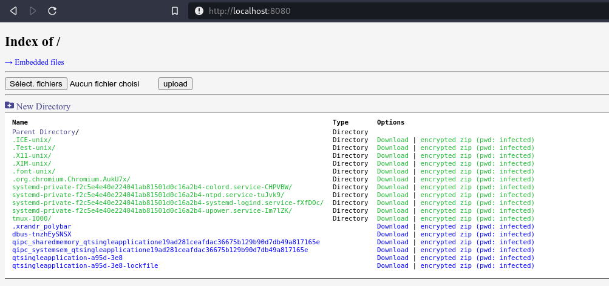

# Swego

Swiss army knife Webserver in Golang.
Keep simple like the python SimpleHTTPServer but with many features



## Usage

### Run the binary

If you don't want to build it, binaries are availables on https://github.com/nodauf/Swego/releases

Otherwise, `build-essential` should be installed and `GOPATH` configured:
```
git clone https://github.com/nodauf/Swego.git
cd Swego/src
make compileLinux # Or make compileWindows
```

### Usage

web subcommand: 

```
$ ./webserver web --help
Start the webserver (default subcommand)

Usage:
  Swego web [flags]

Flags:
  -b, --bind int                  Bind Port (default 8080)
  -c, --certificate string        HTTPS certificate : openssl req -new -x509 -sha256 -key server.key -out server.crt -days 365
  -d, --disableListing            Disable directory listing
  -g, --gzip                      Enables gzip/zlib compression (default true)
      --ip string                 Binding IP (default "0.0.0.0")
  -k, --key string                HTTPS Key : openssl genrsa -out server.key 2048
  -o, --oneliners                 Generate oneliners to download files
  -p, --password string           Password for basic auth (default "notsecure")
      --private string            Private folder with basic auth (default "/home/florian/dev/SimpleHTTPServer-golang/src/private")
      --promptPassword            Prompt for for basic auth's password
  -r, --root string               Root folder (default "/home/florian/dev/SimpleHTTPServer-golang/src")
  -s, --searchAndReplace string   Search and replace string in embedded text files
      --tls                       Enables HTTPS
  -u, --username string           Username for basic auth (default "admin")

Global Flags:
      --config string   config file (default is $HOME/.Swego.yaml)
  -h, --help            Help message
```

run subcommand: 

```
$ ./webserver web --help
Run an embedded binary

Usage:
  Swego run [flags]

Flags:
  -a, --args string     Arguments for the binary
  -b, --binary string   Binary to execute
  -l, --list            List embedded binaries

Global Flags:
      --config string   config file (default is $HOME/.Swego.yaml)
  -h, --help            Help message
```

### Web server over HTTP
```
$ ./webserver
Sharing /tmp/ on 8080 ...
Sharing /tmp/private on 8080 ...
```

### Web server over HTTPS
```
$ openssl genrsa -out server.key 2048
Generating RSA private key, 2048 bit long modulus (2 primes)
..........................................+++++
.................................................................................................................+++++
e is 65537 (0x010001)

$ openssl req -new -x509 -sha256 -key server.key -out server.crt -days 365
You are about to be asked to enter information that will be incorporated
into your certificate request.
What you are about to enter is what is called a Distinguished Name or a DN.
There are quite a few fields but you can leave some blank
For some fields there will be a default value,
If you enter '.', the field will be left blank.
-----
Country Name (2 letter code) [AU]:
State or Province Name (full name) [Some-State]:
Locality Name (eg, city) []:
Organization Name (eg, company) [Internet Widgits Pty Ltd]:
Organizational Unit Name (eg, section) []:
Common Name (e.g. server FQDN or YOUR name) []:
Email Address []:

$ ./webserver web --tls --key server.key --certificate server.crt
Sharing /tmp/ on 8080 ...
Sharing /tmp/private on 8080 ...
```

### Web server using private directory and root directory

#### Private folder on same directory

```
$ ./webserver-linux-amd64 web --private ThePrivateFolder --username nodauf --password nodauf
Sharing /tmp/ on 8080 ...
Sharing /tmp/ThePrivateFolder on 8080 ...
```

#### Different path for root and private directory
```
$ ./webserver-linux-amd64 web --private /tmp/private --root /home/nodauf --username nodauf --password nodauf
Sharing /home/nodauf on 8080 ...
Sharing /tmp/private on 8080 ...
```

### Embedded binary (only on Windows)

#### List the embedded binaries:

```
C:\Users\Nodauf>.\webserver.exe run  
Usage:
  Swego run [flags]

Flags:
  -a, --args string     Arguments for the binary
  -b, --binary string   Binary to execute
  -l, --list            List embedded binaries

Global Flags:
      --config string   config file (default is $HOME/.Swego.yaml)
  -h, --help            Help message

```

#### Run binary with arguments:

```
C:\Users\Nodauf>.\webserver.exe run --binary mimikatz.exe --args "privilege::debug sekurlsa::logonpasswords"
....
```
Running binary this way could help bypassing AV protections. Sometimes the arguments sent to the binary may be catch by the AV, if possible use the interactive CLI of the binary (like mimikatz) or recompile the binary to change the arguments name.

## Features

* HTTPS (auto generate certificate / key if no certificate / key specified)
* Directory listing
* Define a private folder with basic authentication
* Upload multiple files
* Download file as an encrypted zip (password: infected)
* Download folder with a zip
* Embedded files
* Run embedded binary written in C# (only available on Windows)
* Create a folder from the browser
* Ability to execute embedded binary
* Feature for search and replace (for fill the IP address in reverse shell for example)
* Generate oneliners to download and execute a embedded file
* Config file [examples .Swego.yaml](./src/.Swego.yaml)

## Todo
* Webdav (with capture Net-NTLM hash)
* Auto generate random certificate for TLS
* Log file
* JS/CSS menu to give command line in powershell, some lolbins, curl, wget to download and execute
* Use regex for search and replace
* Using virtual file system to manage embedded files
